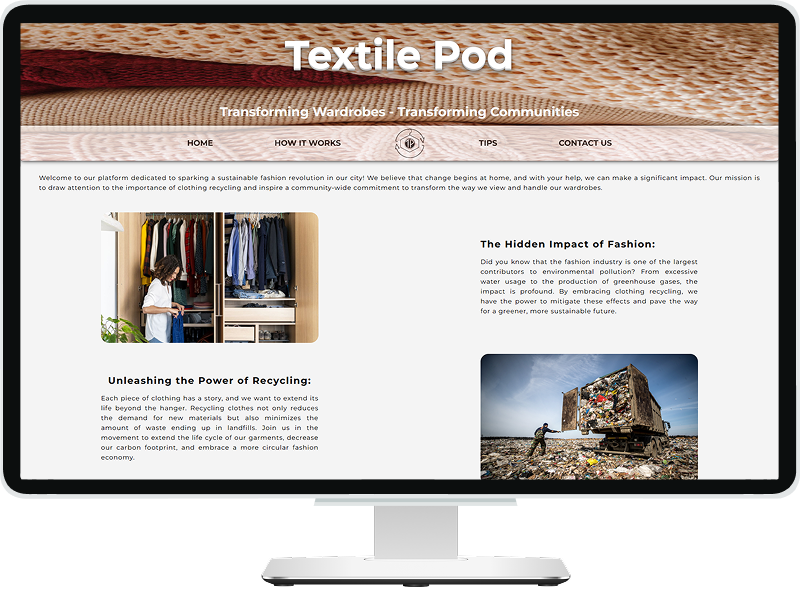

# Project name: Textile POD

### Project Goals:

As a front-end developer, your responsibility is to design a visually appealing, user-friendly website for Textile POD using HTML, CSS(and JAVASCRIPT if you are familiar with it)

- An engaging and visually appealing homepage that introduces Textile POD mission.
- Create an appealing and minimalistic LOGO for the page which reflects our work.
- Mission of the business is to bring awareness in the city to recycle clothes.
- This website should answer the following questions:
  - What can you do with clothes which you don’t need anymore
  - Do you want to sell your unwanted yet good condition clothes? Where to sell?
  - Donate or Dump clothes:
    - Where to donate
    - Should I do it on my own
    - Can anyone come to pick up.
    - Price(is it free or do I need to pay money for the pick up service).

### Contributors:

[Moebag](https://github.com/Moebag) - Contact us, How it works pages  
[stianb10](https://github.com/stianb10) - Home page  
[Inna-B10](https://github.com/Inna-B10) - Tips page, logo, 3D site title, navigation panel

 

